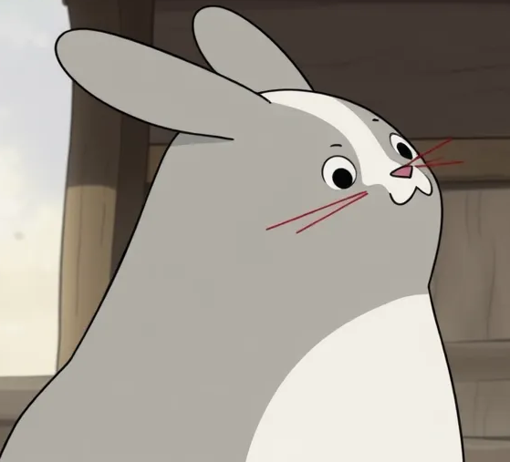
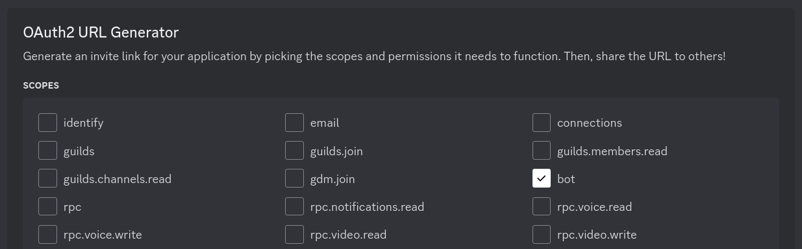
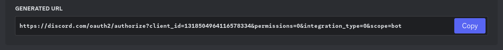
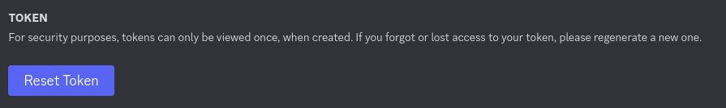
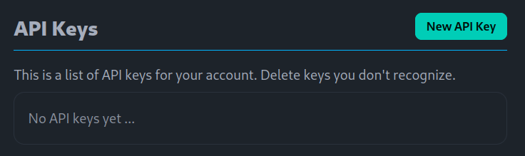
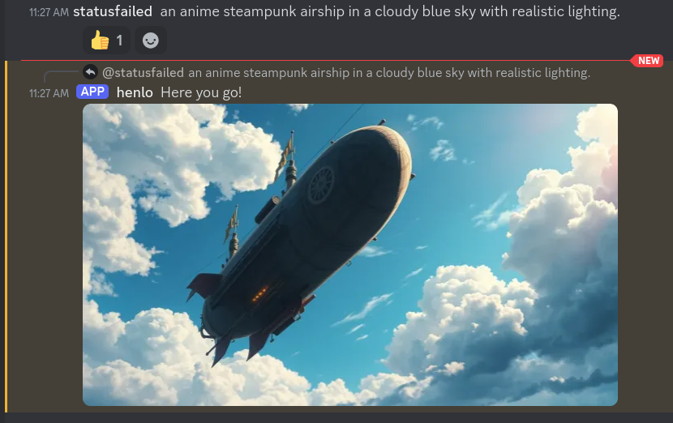

<h1>Build a Discord Image Bot in Rust</h1>

In the [hellas.ai Discord](https://discord.gg/YWZCWPrNTb), we have an image
generation bot called `@henlo`.
Message `@henlo` or DM it your prompt, and it will respond with an image.

This repo will let you **create your own bot** in 5 minutes using:

- The Discord API via Rust's [serenity](https://docs.rs/serenity/latest/serenity/) library.
- [flux schnell](https://huggingface.co/black-forest-labs/FLUX.1-schnell) running on [ezgen](https://ezgen.net).

# Run

After cloning this repository, you'll need two API keys in the `.env` file:

    EZGEN_TOKEN=
    DISCORD_TOKEN=

Set these, then run the bot with

    cargo run

To get the two API keys, follow the instructions below.

# Create a Discord App & Bot

Go to the discord [applications page](https://discord.com/developers/applications),
click "New Application" and choose a name.

In the "OAuth2" tab, under "OAuth2 URL Generator", select the `bot` permission.

Copy the generated URL at the bottom of the page, and open in your browser to
add the bot to a server you are admin of.

Lastly, to get the bot token go to "Bot", then click "Reset Token":

Add this to `DISCORD_TOKEN` in the bot's .env file.

# Set up ezgen

Next, use my [referral link](https://ezgen.net/signup?referred_by=42da63dd-d6c2-4c08-8044-0e92dbbf0d12)
to sign up for ezgen.net.
This should get you 20 free credits.

Next, create an API key by clicking "New API Key" and choosing a name for the key.

Copy the secret (starting with `key_`) and make sure to save it as the `EZGEN_TOKEN` field in `.env`.

# Run the bot

You should now be able to run the bot:

    cargo run

You should see something like this:

    >cargo run
    Finished `dev` profile [unoptimized + debuginfo] target(s) in 0.11s
    Running `target/debug/example-discord-image-bot`
    <yourbotname> is connected!

To generate an image, either DM the bot directly, or @mention it in a channel.
The bot will give a thumbs-up to show it's working, and then reply to your
message with the result.

# Modify the bot

The main bot code is in [./src/bot.rs](./src/bot.rs) in the `impl EventHandler for Bot`.
The code is intended to show a few different features of [serenity](https://docs.rs/serenity/latest/serenity/):

- [Getting message metadata](https://github.com/statusfailed/example-discord-image-bot/blob/main/src/bot.rs#L39)
- [Reacting to a message](https://github.com/statusfailed/example-discord-image-bot/blob/main/src/bot.rs#L48)
- [Replying to a message with an image](https://github.com/statusfailed/example-discord-image-bot/blob/main/src/bot.rs#L92)

You should probably start by playing with this file first.
